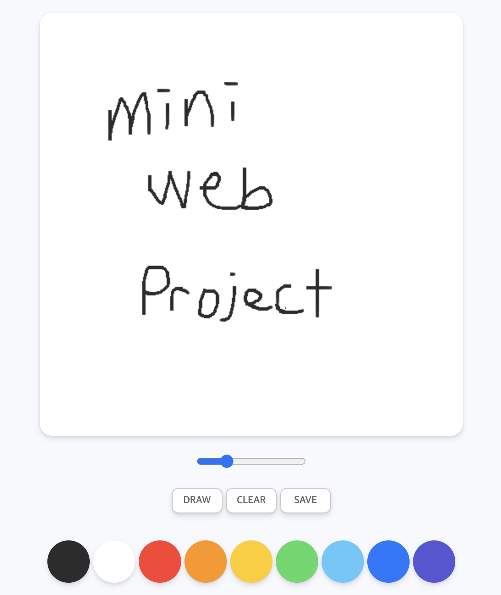

# paint.js

 

Nomade Coder의 강의내용을 바탕으로 제작한 그림판입니다.  
강의를 바탕으로 제작 후 두 가지 기능을 추가하였습니다. 

### 기본 기능

1. 클릭과 드래그를 이용해 그림판 내에 그림을 그릴 수 있습니다.
2. input의 range타입을 이용하여 브러쉬의 사이즈를 조절할 수 있습니다.
3. fill, draw 모드를 클릭됨에 따라 각각의 기능을 사용할 수 있습니다.
4. 그림을 완성하면 save 버튼을 이용해 자신의 작품을 저장할 수 있습니다.

### 추가 기능 구현

- [x] reset 버튼을 누르면 지금까지 작성된 내용이 초기화됩니다.  
- [x] 작품을 저장할 때 사용자가 원하는 이름과 원하는 위치를 선택해 저장이 가능합니다.
